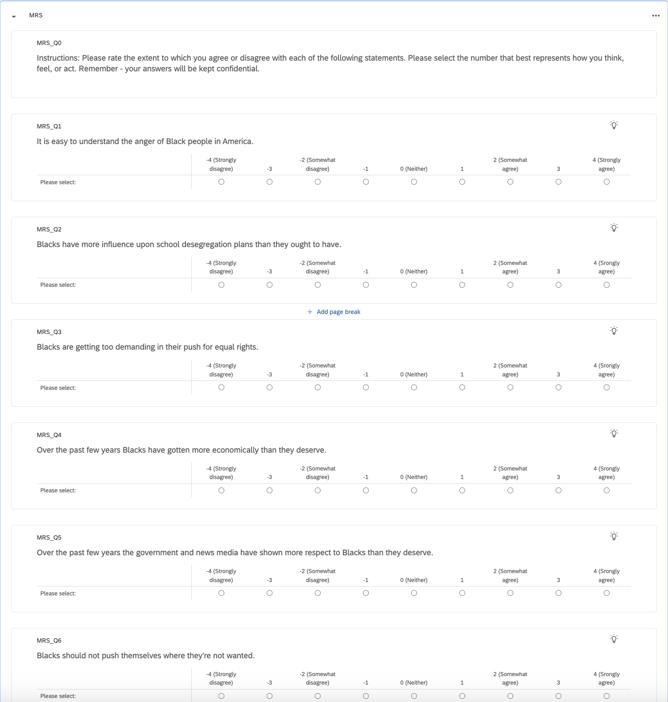
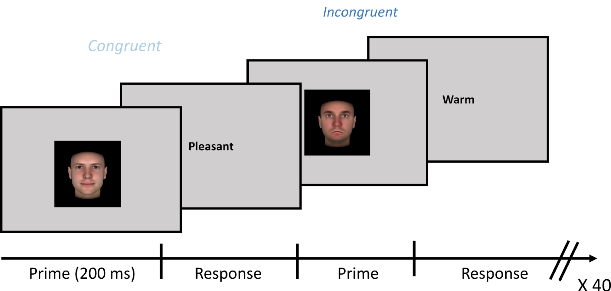
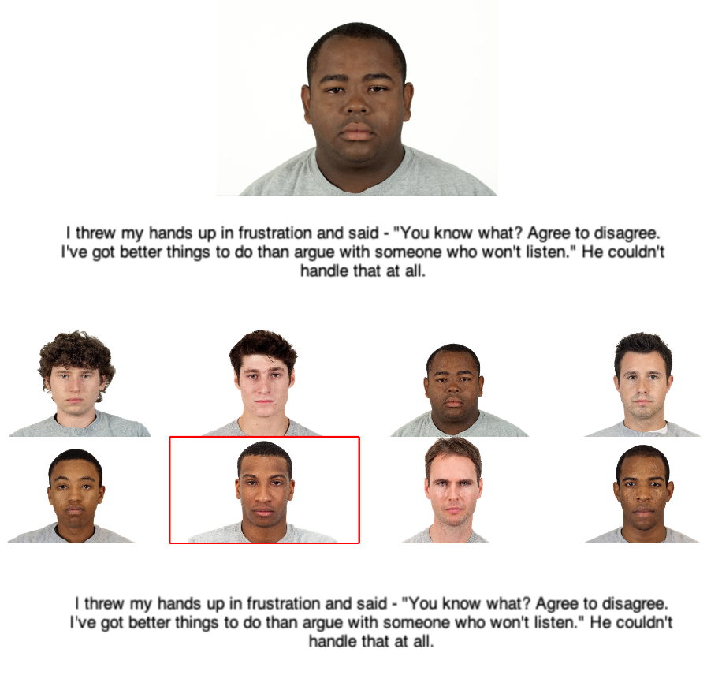

# Introduction
Welcome! [jsPsych](https://www.jspsych.org/7.3/) is a great tool for conducting online (and in person) experiments. More and more psychologists have begun using it - it’s almost at 1k stars on GitHub! Implementing it on our server is also super straightforward and easy to use (and already set up). 

Our lab’s current way of running online experiments is very outdated (Jon hired a software engineer to set it up around 2012). Some scripts don’t run anymore, certain links are broken, and there is no documentation - making it hard to fix bugs/issues and customize parameters. Not to mention, you can’t use ChatGPT/Copilot 😅. 

When writing these scripts, please make sure they are **well-commented and easily customizable** (ideally via a config file). **Try not to hard code any parameters/settings** - make sure things are easily changeable. Here are some concrete examples of what I mean: 

- **Example 1**: when setting the image height/wide, make this changeable in the config file. 
- **Example 2**: when rating images, make it loop through a list/array of images/image_names - don’t make it so you have to call an image every time. 
- **Example 3**: When you say “this experiment takes {XXX} minutes to complete” in the instructions page, make sure that XXX is a variable in config.

As with any good psychology experiment, **randomization** is usually a must. Make sure there is an easy way to randomize your experiments, whether that be through jsPsych or creating a function that randomizes an array of image names. 

There are many great ready-to-go scripts and examples available [online](https://github.com/jspsych/jsPsych/tree/main/examples). Feel free to use them - there is no need to start everything from scratch! 

# Getting Started
1. Go through the jsPsych [tutorials](https://www.jspsych.org/7.3/tutorials/hello-world/). Use **option** 2 (_I want to be able to do some customization, but have a simple setup; Download and host jsPsych_)
3. Indicate on **Slack which project you are working** on! We don’t want 2 people working on the same thing, and there is lots to choose from!
4. To start a script, clone this repo, then **make a copy of the SampleExperiment folder**. See the [template](#template) section below for more details.
4. Name each trial with an intuitive name (for data saving later)
   1. i.e: don't call a rating trial simply 'Task1'.
5. If you are working on a script that requires images/word_vectors, you can use your own images/words lists, and loop over them for the experiments. 
6. Additional scripts to clean/analyze the data would be great but not necessary at the moment
7. Push the folder to the github repo!

# Template
[SampleExperiment](https://github.com/fajardgb/jsPsych-FreemanLab/tree/main/SampleExperiment) serves as a template experiment that does the following:
- Shows the consent form at the beginning (imported from [consent.js](https://github.com/fajardgb/jsPsych-FreemanLab/blob/main/consent.js))
- Shows the demographics survey at the end (imported from [demographics.js](https://github.com/fajardgb/jsPsych-FreemanLab/blob/main/demographics.js))
- Imports variables from a config file
- Saves data as a csv at the end with a random subject ID

You can **make a copy** of the SampleExperiment folder to start your own script! Simply code your trials as normal in the **main.js** file between the `//EXPERIMENT CONTENT GOES HERE` and `//END OF EXPERIMENT CONTENT` comments. You can add any variable to the config file like so:
```javascript
const config = {
      //Comment explaining what the variable does
      exampleVariable: "Something", //don't forget the comma!

      //You can make any variable, not just text!
      numberVariable: 3,
}
```

The config file is already imported into the main file, so you can use those variables in main.js by doing `config.<variableName>`. Here is an example:
```javascript
var task = {
      type: jsPsychHtmlKeyboardResponse,
      stimulus: config.instructions //this uses the variable from config
}
```

# Online vs. Local (+ fMRI)
We need to add instructions on how to run experiments locally (e.g. for fMRI sessions) or hosting experiments online. 

Also, for fMRI, need to add 'waiting for scanner' page before each run, fixation, make text bigger, anything else? 
- Trigger = '5'

3 types:
- local (debugging)
- local fMRI
- online

# Projects
Ordered roughly by difficulty

## Survey: Demographics
See [template](https://github.com/fajardgb/jsPsych-FreemanLab/blob/main/demographics.js)!

Completed!

## Survey: MRS, SPS, NFCS, RES, FT
Easy surveys - would be a good start. If interested in working on them let me know and I'll show you what the questions for them are! We have them implemented on Qualtrics, but not everyone has access to Qualtrics. 



## Survey: Consent Page
Completed! See [template](https://github.com/fajardgb/jsPsych-FreemanLab/blob/main/consent.js)!

## Rating Images: single trait at a time

Completed!

## Rating Images: two traits at a time

Same as above, but asks particpants to rate an image on 2 traits at a time!

## Rating Images: N traits at a time

Same as above, but with N traits!

## FreeResponse Images/Words: one at a time
This one is already done, but could add more comments/customizability. 
- Trait array - defined in the config? 
- If we are rating words, we shouldn’t need to use jpegs - only text / HTML
    - Use a table or something 

See the [code](https://github.com/fajardgb/jsPsych-FreemanLab/tree/main/TraitAntonyms)!

## FreeResponse Rate PairwiseSimilarity

See this [paper](https://www.pnas.org/doi/full/10.1073/pnas.1807222115?doi=10.1073/pnas.1807222115) for a description of the task. 

I implemented this already, see this [example](https://github.com/fajardgb/jsPsych-FreemanLab/tree/main/TraitPairwiseSim). This might already work, but needs to be fleshed out more. 

## Ordinal Rating: two choices

Which one of these two images is more Trustworthy? 

## Ordinal Rating: N choices

Which one of these (N) images is more Trustworthy? 

## Passive Viewing of Images (or 1-back)
Passively view images. Each image is shown for 2s, ISI of 2-6s (randomly sampled to start with). 

Needed: 
1. Add probe condition, for 1-back task, so some images are repeated twice in a row. If an image is repeated, the participant should press a button.
2. Add fMRI trigger/waiting for scanner page

## Mousetracking
Implement any mousetracking script!

## Implicit Association Test (IAT)
I made this one for a post-scan task, but it still needs some work/customizability. See the [example](https://github.com/fajardgb/jsPsych-FreemanLab/tree/main/IAT). 

## Videos: Rate at end
Watch a video, rate it after it is over

## Videos: Rate halfway through 
Watch a video, be able to pause/rate it halfway thorugh.

## Videos: Rate continously with a slider
Completed!

## Videos: Rate continously with a button presses
Left and right keys (or 's' and 'k' keys) move the slider/rating left-right

## Videos: FreeResponse (halfway through at end also)
Watch a video, and make it be able to input a word halfway through the video

Make it be pausable? Or stop at certain timepoints, and ask for a response. 

## Trust Game

[wikipedia](https://en.wikibooks.org/wiki/Bestiary_of_Behavioral_Economics/Trust_Game)

## Semantic Decision Task

Prime participant with an image, then ask them to respond (categorize) a word (eg: as good or bad)



## Who-Said-What task

3 phases: encoding, distractor, retrieval

Encoding:
- show face for 3s, 2-4s ISI, 7s face + sentence

Distractor: 
- show X dots on the screen, followed by a number. Respond if the number is less than or more than the number of dots shown prior. 

Retrieval:
- Show sentence, 2-4s ISI, 6s grid
- Make a red box around the grid - they can move it around left to right to make decision about WHO-SAID-WHAT



## To-Do:
- Make 3 different types of studies:
   - Online
   - Local (fMRI; just would need wait for scanner/trigger, timepoints of each stim)
   - Local (debugging, saving locally)

- For the sub_id at each filename, have an option where for online studies, it uses the Prolific ID instead.
- Add instructions on how to save online / server. 


